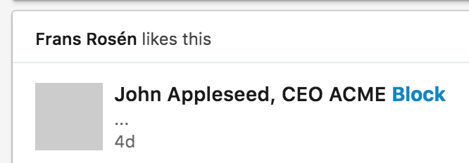
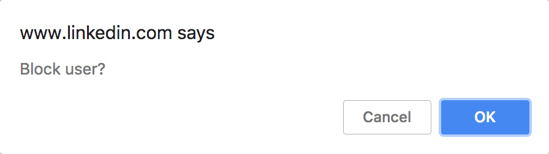
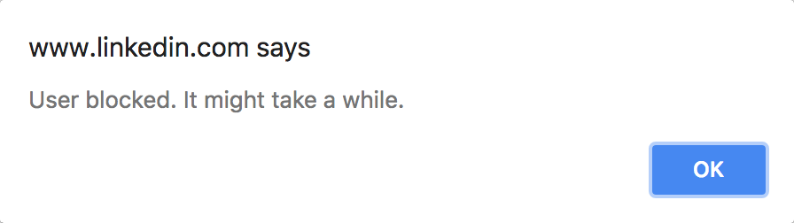

# li-shortblock

Written by [Frans Rosén](http://twitter.com/fransrosen) after an idea by [Piotr Zaleski](https://www.linkedin.com/feed/update/urn:li:activity:6421718299293417472/).

Adds a shortcut to linkedin-feed to block users. Uses https://github.com/rafaelw/mutation-summary to quickly find mutations in the DOM.

All users in the feed should get a Block-link added next to the name:

A confirm will show up and ask if you really want to block the user:

And will confirm if the block went well:

Page will then reload and hopefully the posts should be gone from the user you blocked.

### Installation

Download the ZIP from this repo. Go to `chrome:extensions` and select `LOAD UNPACKED`. Select the `chrome`-directory in the ZIP. Reload any linkedin-tabs after to see the shortcut.

